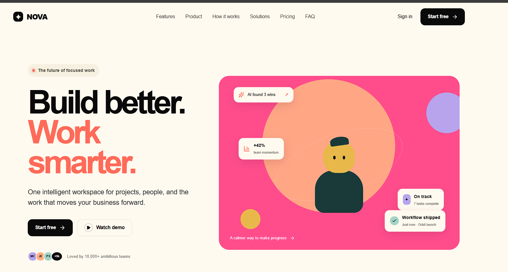
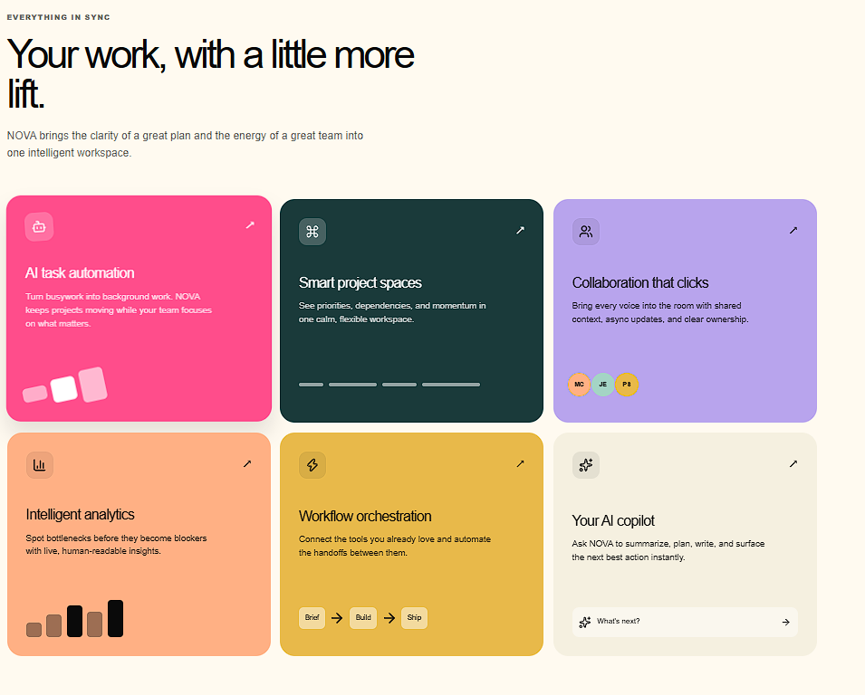
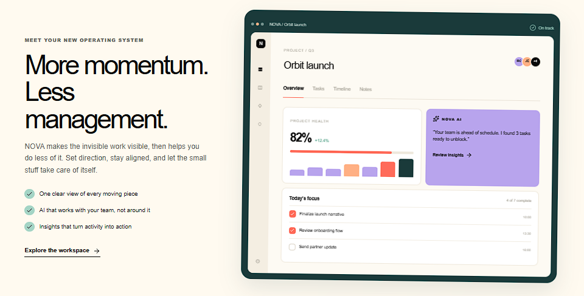
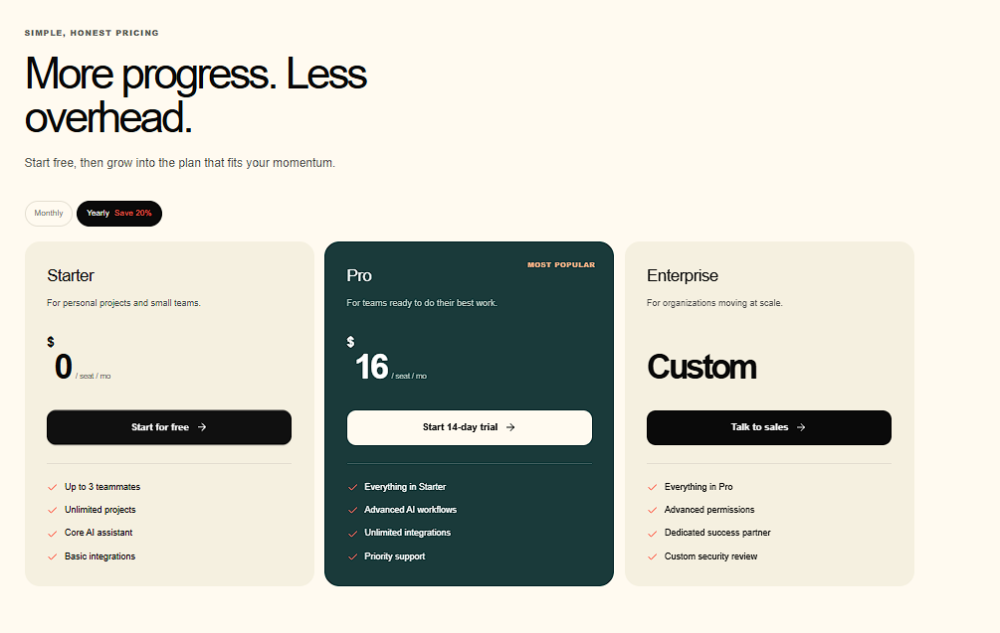

# NOVA — The Intelligent Workspace

**Live demo:** [https://nova-psi-green.vercel.app/](https://nova-psi-green.vercel.app/)

## Project Description

NOVA is a marketing landing page for an AI-powered productivity platform aimed at teams who manage projects, automate repetitive work, and collaborate with less friction. The page walks visitors through NOVA's value proposition — from the hero pitch ("Build better. Work smarter.") through feature highlights, role-based use cases (Engineering, Product, Marketing, Design), a customer testimonial, transparent pricing tiers, and an FAQ — closing with a final call to action to start using the product for free.

## Technologies Used

- **Next.js** — React framework used to build and structure the site
- **Vercel** — hosting and deployment
- Modern CSS/component-based styling for layout, responsive design, and interactive UI elements (tabs, accordions, carousels)

## Features

- **Hero section** with primary CTAs ("Start free" / "Watch demo") and a live product-style illustration
- **Social proof bar** showing trusted teams and adoption stats (10K+ teams, 2M+ tasks automated, 98% satisfaction, 40% faster workflows)
- **Feature grid** highlighting AI task automation, smart project spaces, collaboration tools, intelligent analytics, workflow orchestration, and an AI copilot
- **Product walkthrough** panel showing a sample project dashboard with live project health metrics and AI-generated insights
- **"The NOVA Method"** — a 4-step process (Connect → Plan → Automate → Deliver)
- **Role-based tabs** (Engineering, Product, Marketing, Design) that swap in tailored messaging and visuals
- **Customer testimonial carousel**
- **Pricing section** with Monthly/Yearly toggle and three tiers: Starter (Free), Pro ($16/seat/mo), and Enterprise (Custom)
- **FAQ accordion** answering common questions about the product
- **Final CTA banner** and a full site footer with product, solutions, company links, and a newsletter signup

## Installation Instructions

```bash
# Clone the repository
git clone https://github.com/Animeshhit/NOVA-Landing-Page/
cd nova-landing-page

# Install dependencies
npm install

# Run the development server
npm run dev

# Open http://localhost:3000 in your browser
```

To build for production:

```bash
npm run build
npm start
```

## Screenshots

**Hero section**


**Feature grid**


**Product dashboard**


**Pricing**


## Live Demo URL

🔗 [https://nova-psi-green.vercel.app/](https://nova-psi-green.vercel.app/)

## AI Tools Used

This project was built with the help of AI website builders — **v0**, **Lovable**, and **Bolt** — for rapid layout generation, component scaffolding, and UI iteration.
